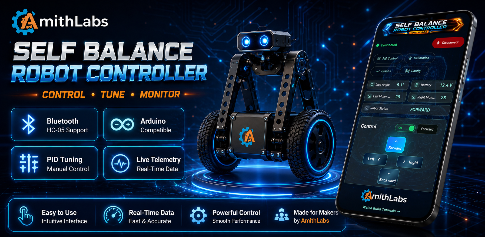
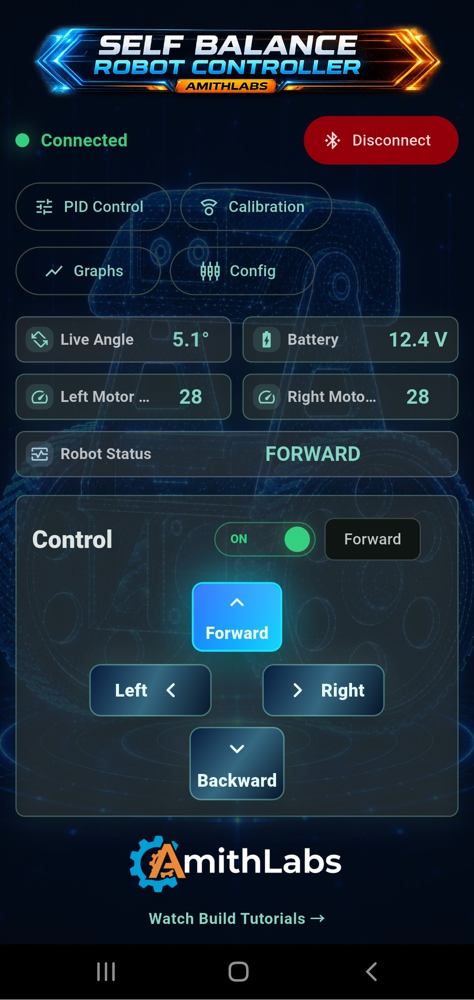
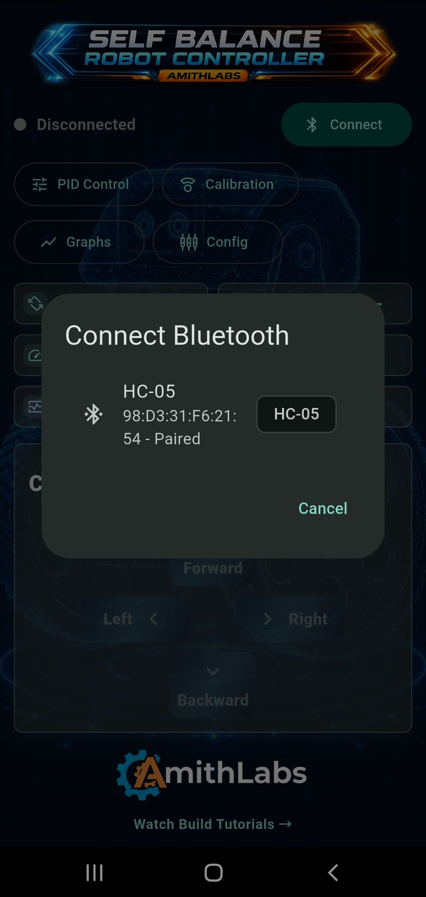
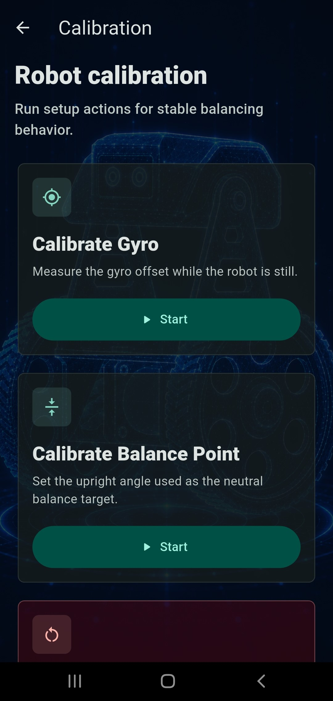
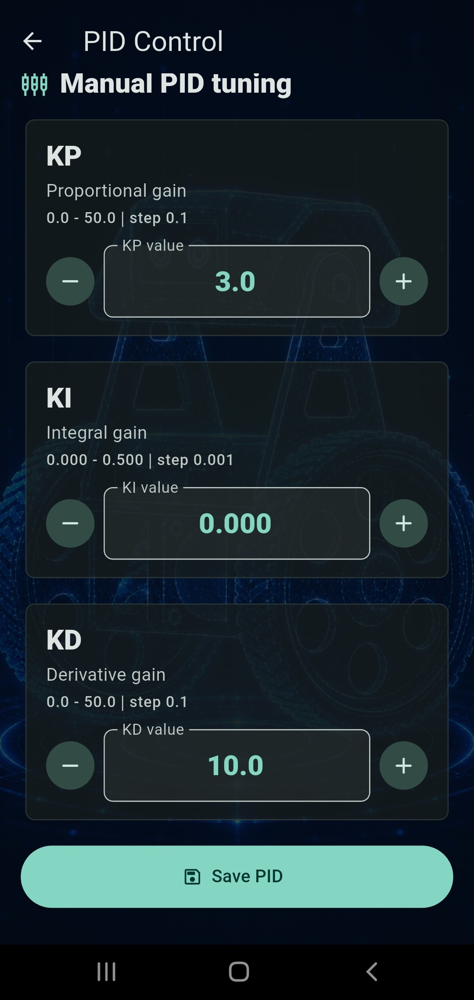
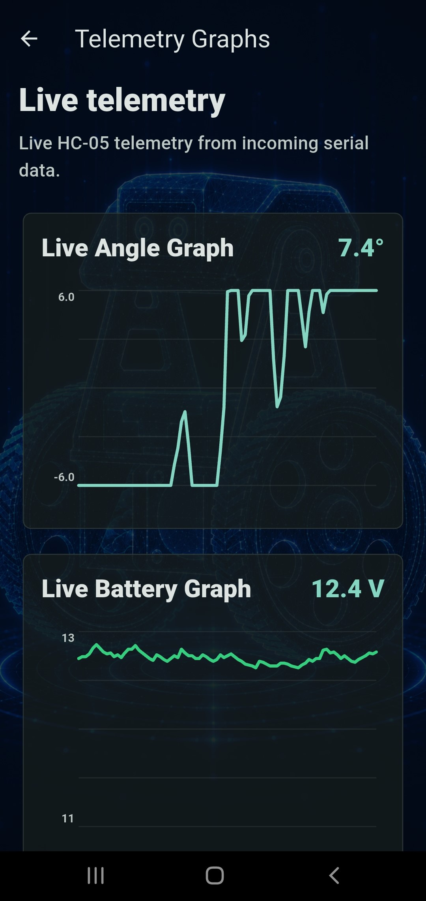
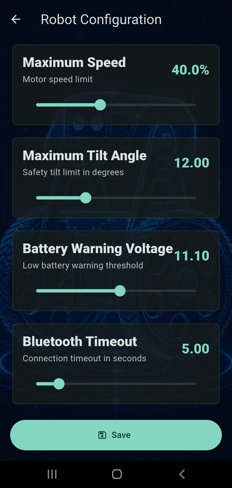

# AL-BalanceBot

<p align="center">
  
</p>

<p align="center">


</p>

---

# 📱 About

**AL-BalanceBot** is a professional Android application developed by **AmithLabs** for controlling and tuning Arduino based self-balancing robots through Bluetooth communication.

The application provides an all-in-one interface for:

- Bluetooth connection management
- Live robot telemetry
- Manual PID tuning
- Robot calibration
- Robot configuration
- Real-time monitoring
- Mobile robot control

The app is designed for robotics enthusiasts, makers, students and automation engineers who build Arduino self-balancing robots.

---

# 🎬 Demo Video

Watch the complete build, wiring and testing video on YouTube.

[](https://www.youtube.com/watch?v=YOUR_VIDEO_ID)

---

# ✨ Main Features

✅ Bluetooth HC-05 Connection

✅ Real-Time Telemetry

✅ Live Angle Monitoring

✅ Battery Voltage Monitoring

✅ Motor Speed Monitoring

✅ Robot Status Monitoring

✅ Manual PID Tuning

✅ Robot Calibration

✅ Robot Configuration

✅ Mobile Robot Controller

---

# 📸 Application Screens

## Home Screen

<p align="center">

</p>

The home screen provides instant access to all major robot functions including Bluetooth connection, PID tuning, calibration, telemetry graphs, configuration, live robot status and directional controls.

---

## Bluetooth Connection

<p align="center">

</p>

Secure Bluetooth connection with HC-05 compatible modules for wireless communication between the Android application and the Arduino controller.

---

## Calibration

<p align="center">

</p>

Includes robot calibration tools such as:

- Gyroscope Calibration
- Balance Point Calibration

These tools help improve balancing accuracy before operation.

---

## PID Controller

<p align="center">

</p>

Manual adjustment of:

- KP
- KI
- KD

PID values can be sent directly to the robot through Bluetooth.

---

## Live Telemetry

<p align="center">

</p>

Real-time telemetry visualization including:

- Live Angle Graph
- Battery Voltage Graph

Incoming serial data is displayed instantly for easier debugging and tuning.

---

## Robot Configuration

<p align="center">

</p>

Configure important robot parameters including:

- Maximum Speed
- Maximum Tilt Angle
- Battery Warning Voltage
- Bluetooth Timeout

---

# 🏗️ Project Architecture

The AL-BalanceBot system consists of an Android application communicating wirelessly with an Arduino-based self-balancing robot using Bluetooth Classic (HC-05).

```text
                    AL-BalanceBot System

        ┌─────────────────────────────────────┐
        │         Android Smartphone          │
        │                                     │
        │      AL-BalanceBot Android App      │
        └─────────────────────────────────────┘
                       │
                       │ Bluetooth Classic
                       │ HC-05
                       ▼
        ┌─────────────────────────────────────┐
        │           Arduino Nano              │
        │      CNC Shield V4 Controller       │
        └─────────────────────────────────────┘
            │          │            │
            │          │            │
            ▼          ▼            ▼
       MPU6050      OLED       HC-05 Module
     IMU Sensor    Display

            │
            ▼

      Balance Algorithm
     PID Control System

            │
            ▼

      DRV8825 Driver (Left)
      DRV8825 Driver (Right)

            │
            ▼

    NEMA17 Stepper Motors ×2

            │
            ▼

      Self-Balancing Robot
```

---

# 🔩 Hardware Components

| Component | Description |
|-----------|-------------|
| Arduino Nano | Main robot controller |
| Arduino Nano CNC Shield V4 | Expansion board for stepper motor control |
| MPU6050 | Gyroscope and accelerometer for balance measurement |
| HC-05 | Bluetooth Classic communication module |
| DRV8825 ×2 | Bipolar stepper motor drivers |
| NEMA17 ×2 | Drive motors |
| 0.97" OLED Display | Robot status display |
| 3S Li-ion Battery Pack | Main power source |

---

# 🔌 Hardware Documentation

Complete hardware documentation is available below.

| Document | Description |
|----------|-------------|
| ➜ [Wiring Diagram](hardware/Wiring_Diagram.png) | Complete Arduino Nano CNC Shield wiring |
| ➜ [Arduino Program](Arduino/AL-BalanceBot_v1.0.ino) | Main robot firmware |
| ➜ [Arduino Parameters Guide](Arduino/Parameter_Tuning_Guide.md) | Complete parameter tuning guide |
| ➜ [Bluetooth Protocol](docs/Bluetooth_Protocol.md) | Bluetooth communication protocol |
| ➜ [Calibration Procedure](docs/Self_Balancing_Robot_Calibration_Procedure.md) | Step-by-step robot calibration before first use |

---

# ⚙️ System Workflow

1. User opens the **AL-BalanceBot** Android application.
2. The app connects to the robot through the HC-05 Bluetooth module.
3. The Arduino Nano receives commands from the mobile application.
4. The MPU6050 continuously measures the robot tilt angle.
5. The PID controller calculates the correction required.
6. DRV8825 drivers control both NEMA17 motors.
7. Live telemetry is transmitted back to the mobile application.
8. The app displays real-time robot status, battery voltage, angle, and motor information.

---

# 📡 Bluetooth Communication Protocol

AL-BalanceBot communicates with the robot using Bluetooth Classic (HC-05).

## Connection

| Item | Value |
|------|-------|
| Module | HC-05 |
| Communication | Bluetooth Classic |
| Baud Rate | 115200 |
| Data Format | ASCII Text |
| Direction | Bidirectional |

---

## Command Flow

```text
Android App
      │
      │ Bluetooth
      ▼
HC-05 Module
      │
      ▼
Arduino Nano
      │
      ▼
PID Controller
      │
      ▼
Motors
```

---
### 📘 Full Bluetooth Protocol Specification

For the complete Bluetooth communication protocol, telemetry packet format, command reference and implementation details, see:

➡️ **[Bluetooth Communication Protocol](docs/Bluetooth_Protocol.md)**

---

## Communication Type

The communication protocol is designed for:

- Low latency
- Continuous telemetry
- Real-time PID tuning
- Live robot monitoring
- Mobile robot control

---

# 🚀 Technologies Used

- Flutter
- Dart
- Arduino
- HC-05 Bluetooth Module
- Bluetooth Classic
- Material Design 3

---

# 👨‍💻 Developed By

**AmithLabs**
https://www.youtube.com/@AmithLabs
Robotics • Arduino • Automation • Engineering

---

# 📄 License

This project is licensed under the MIT License.

See the LICENSE file for details.
